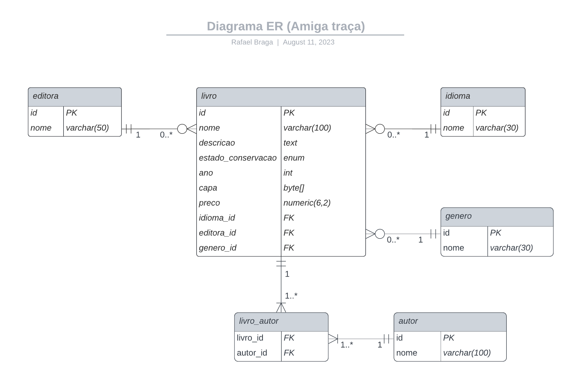

# relatorios-livros

Exemplo de geração de relatórios utilizando Jasper Reports e Java. Para isso, foram criados dois projetos:

* relatorios-livros-web: projeto web com Spring Boot que simula o sistema de um sebo, que pode gerar relatórios de todos os seus livros em estoque ou os detalhes de um livro específico.
* relatorios-livros-jasper: projeto para criação dos relatórios, que pode ser aberto com o Jaspersoft Studio.

Os dados dos livros estão gravados em um banco de dados PostreSQL que sobe junto com a aplicação.

## Tecnologias

* Java 17
* Spring Boot 3.x
* Jasper Reports 6.x
* Docker

## Modelo de dados

## Como rodar

1. Entrar na pasta do projeto **relatorios-livros-web**
1. Realizar o build do projeto através do comando **`mvn clean package`**
1. Executar **`docker-compose up`** para criar as imagens do Docker e realizar o deploy

## Como testar

* Lista dos livros em JSON: `localhost:8080/livros`
* Lista dos livros em PDF: `localhost:8080/livros?pdf`
* Detalhes de um livro em JSON: `localhost:8080/livros/9788535912517`
* Detalhes de um livro em PDF: `localhost:8080/livros/9788535912517?pdf`